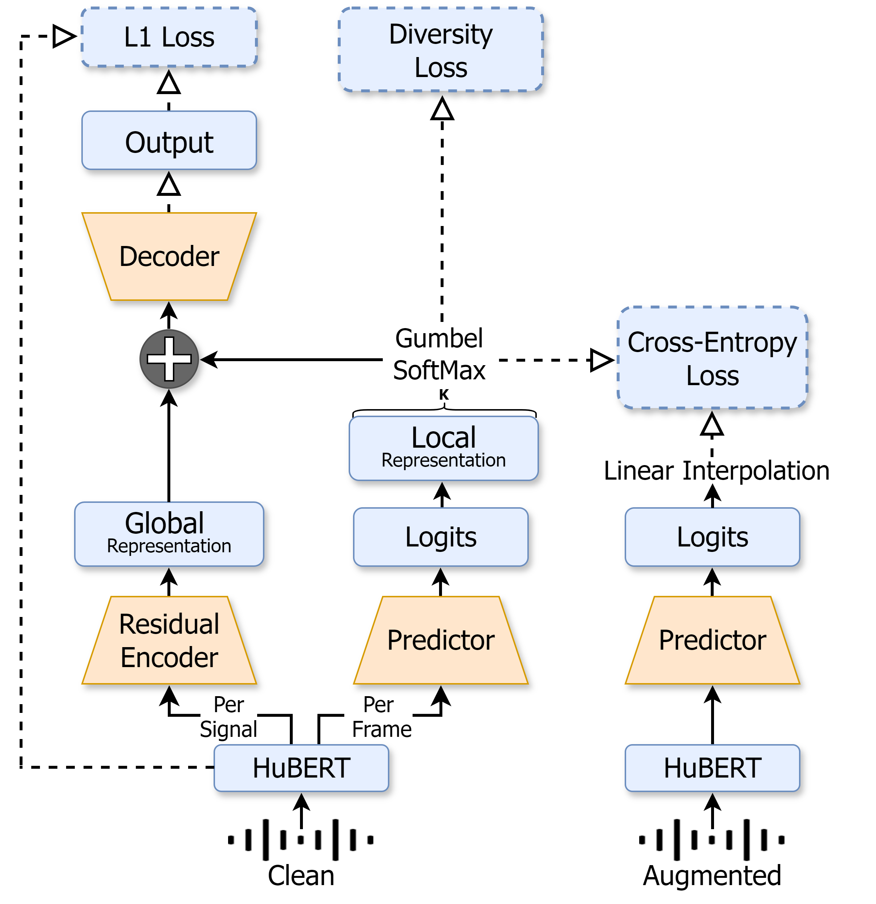

## NAST: Noise Aware Speech Tokenization for Speech Language Models

Official implementation of NAST: Noise Aware Speech Tokenization for Speech Language Models. <br><br>
<p align="center">
  
</p>


<b>Abstract:</b> Speech tokenization is the task of representing speech signals as a sequence of discrete units. Such representations can be later used for various downstream tasks including automatic speech recognition, text-to-speech, etc. More relevant to this study, such representation serves as the basis of Speech Language Models. In this work, we tackle the task of speech tokenization under the noisy setup and present NAST: Noise Aware Speech Tokenization for Speech Language Models. NAST is composed of three main components: (i) a predictor; (ii) a residual encoder; and (iii) a decoder. We evaluate the efficiency of NAST considering several speech language modeling tasks, and show that NAST is superior to the evaluated baselines across all setups. Lastly, we analyze NAST and show its disentanglement properties and robustness to signal variations in the form of noise, reverberation, pitch-shift, and time-stretch. 

## Setup Environment
Create a conda environment and install the requirements:
```python
conda create -n nast
conda activate nast
git clone https://github.com/ShovalMessica/NAST.git

# install requirements
cd nast
conda install --file requirements.txt
```

## Usage Example
```python
import yaml
import torch
from examples.textless_nlp.gslm.speech2unit.pretrained.hubert_feature_reader import HubertFeatureReader
from network import Network

config_path = "/path/to/config.yaml"
audio_path = "/path/to/audio.wav"

with open(config_path, "r") as f:
    config = yaml.safe_load(f)

config["discrete_local"] = True
device = torch.device("cuda" if torch.cuda.is_available() else "cpu")

feature_extractor = HubertFeatureReader(config['checkpoints']['hubert'], layer=9, max_chunk=1600000)
network = Network(config=config, device=device)

audio = feature_extractor.read_audio(audio_path)
features = feature_extractor.get_feats(audio)

with torch.no_grad():
    units = network(features.to(device))

print("Extracted units:", units.tolist())
```

## Acoustic Model
For quantizing speech we learn NAST clustering over HuBERT Base acoustic representation. For using the pretrained model, please download from the link below.
- [HuBERT Base](https://dl.fbaipublicfiles.com/hubert/hubert_base_ls960.pt)

## Tokenization Model
You can download pretrained tokenization model from the list below. 
| NAST Model | Download Link |
|-----------------|:-----------------:|
| HuBERT Base + 50 units | [download](https://drive.google.com/file/d/1PDkV-m-kELx9fUeqmqPFWcbomHNddR1p/view?usp=drive_link)|
| HuBERT Base + 100 units |[download](https://drive.google.com/file/d/199YLQO8InNHfUbxkYjPLDwToPxmaiMi1/view?usp=drive_link)|
| HuBERT Base + 200 units |[download](https://drive.google.com/file/d/1KdyyYpWItsSJEoDLc-qo4YFGTCaUXmBQ/view?usp=drive_link)|

- **Speaker Probing Task:** For insights into speaker information evaluation using the NAST framework, follow the detaileds provided [here](eval/readme.md#speaker-probing-task).

- **UED Calculator:** To evaluate the Unit Edit Distance for models trained with NAST, use our UED calculator. Detailed instructions and tools can be found [here](eval/readme.md#unit-edit-distance-ued-calculation).

## Unit Language Model (ULM)
You can download pretrained unit language models from the list below, or follow the [instructions](https://github.com/facebookresearch/fairseq/tree/main/examples/textless_nlp/gslm/ulm) to train new models using fairseq. All language models were trained and evaluated on the deduplicated unit transcriptions of the respective NAST version.
| ULM Model | Download Link |
|-----------------|:-----------------:|
| NAST + 50 units | [download](https://drive.google.com/file/d/1LssHxGpkpW2l8WbHTrAs7cVx3cILGz0B/view?usp=drive_link) |
| NAST + 100 units | [download](https://drive.google.com/file/d/12PHHoKCInlb_LteYmkd1OI1WCx9iiedq/view?usp=drive_link) |
| NAST + 200 units | [download](https://drive.google.com/file/d/19cBZkrgc7LT8xZT83WcKy0_c9jTDvZ8e/view?usp=drive_link) |
