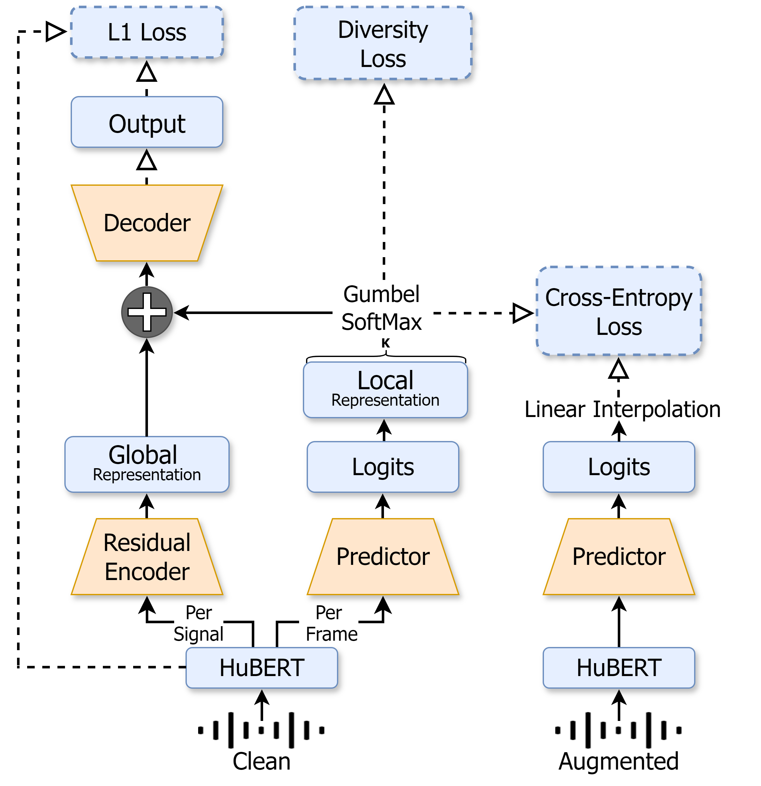

## NAST: Noise Aware Speech Tokenization for Speech Language Models

Official implementation of NAST: Noise Aware Speech Tokenization for Speech Language Models.   

<b>Abstract:</b> Speech tokenization is the task of representing speech signals as a sequence of discrete units. Such representations can be later used for various downstream tasks including automatic speech recognition, text-to-speech, etc. More relevant to this study, such representation serves as the basis of Speech Language Models. In this work, we tackle the task of speech tokenization under the noisy setup and present NAST: Noise Aware Speech Tokenization for Speech Language Models. NAST is composed of three main components: (i) a predictor; (ii) a residual encoder; and (iii) a decoder. We evaluate the efficiency of NAST considering several speech language modeling tasks, and show that NAST is superior to the evaluated baselines across all setups. Lastly, we analyze NAST and show its disentanglement properties and robustness to signal variations in the form of noise, reverberation, pitch-shift, and time-stretch. 

## Acoustic Model
For quantizing speech we learn NAST clustering over HuBERT Base acoustic representation model. For using the pretrained model, please download from the link below.
- [HuBERT Base](https://dl.fbaipublicfiles.com/hubert/hubert_base_ls960.pt)

## Tokenization Model
You can download pretrained tokenization model from the list below. 
| NAST Model | Download Link |
|-----------------|-----------------|
| HuBERT Base + 50 units | Row 1, Column 2 |
| HuBERT Base + 100 units | Row 2, Column 2 |
| HuBERT Base + 200 units | Row 3, Column 2 |

